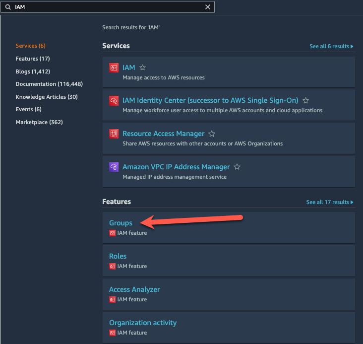
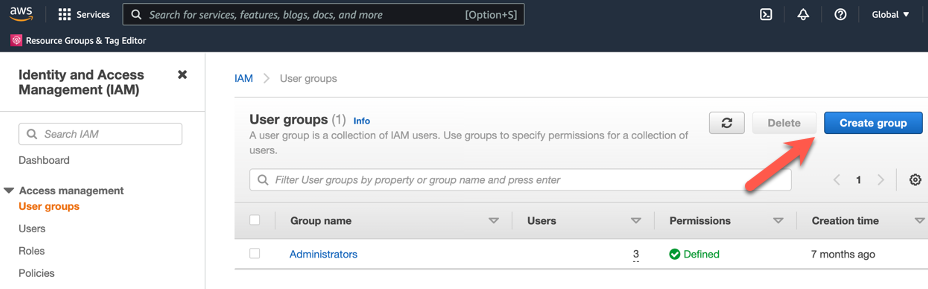
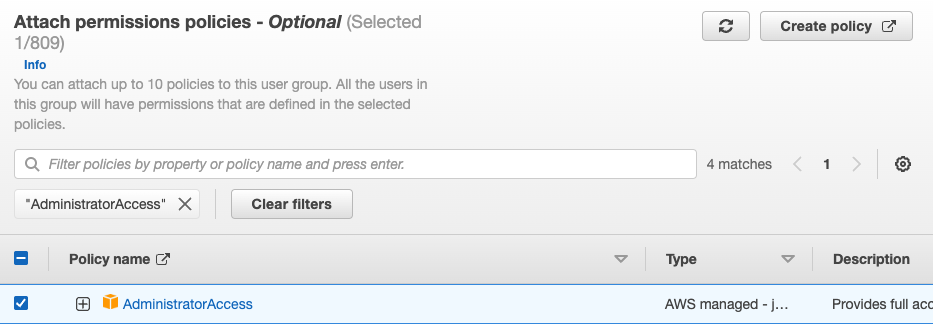
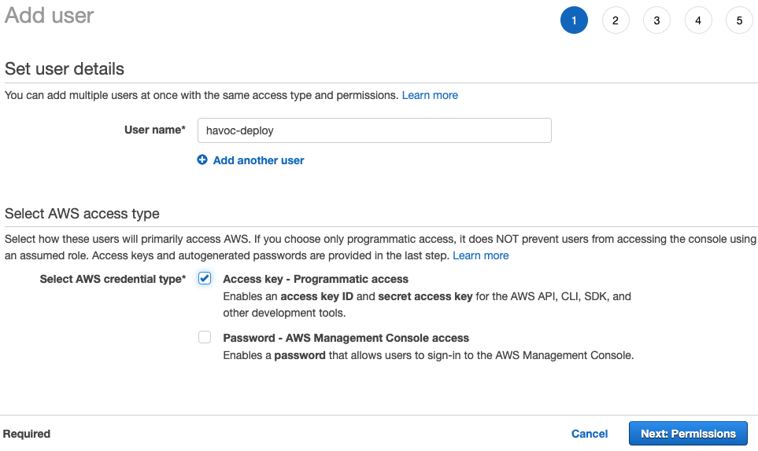
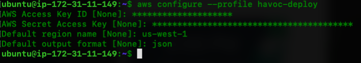
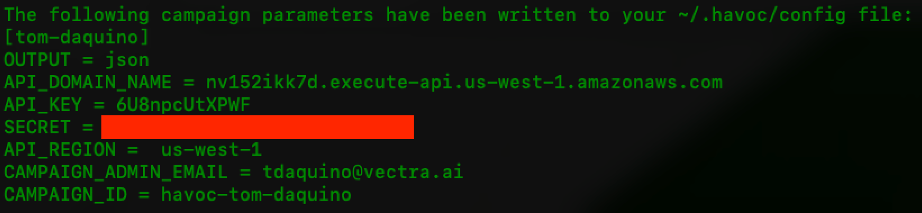

# Deploying a ./HAVOC Campaign

## Overview

./HAVOC is a post-exploitation toolkit that leverages playbooks to automate the deployment of attacker infrastrucure in AWS.  It provides a method to automatically deploy attacker toolkits (such as Powershell Empire and Meterpreter) in containers, and interaction with them via an API.  This allows for a flexible and automated method for testing and emulating advanced attacker TTPs.

In this lab, ./HAVOC establishes a C2 listener via a Powershell Empire "container task" from playbooks which can be configured and run from your command line.

The ./HAVOC GitHub is located [here](https://github.com/havocsh).

## Prerequisites

The prerequisites for a ./HAVOC campaign are as follows:
-   **AWS Account** - Will also need a user that has full admin privileges (required).
-   **A Linux or Mac OS "Campaign Manager"** - Will manage the ./HAVOC campaign and act as the playbook operator. This can be a VM, an EC2 instance or your laptop but it must be a *nix type OS. For simplicity sake, this guide assumes your are using an Intel based Ubuntu VM or EC2 instance for your **Campaign Manager**. If you're using something else, you'll need to adapt the package install instructions accordingly.

<div class="alert alert-info">
    <strong>Note:</strong> If you use an EC2 instance as your **Campaign Manager**, make sure to perform all of your ./HAVOC deployment and playbook operation tasks through a <b>tmux</b> session or you'll run the risk of having an incomplete deployment or orphaned resources as a result of being disconnected from your SSH session (SSH sessions to EC2 instances get disconnected frequently). You can find a <b>tmux</b> cheat sheet here: [Tmux Cheat Sheet & Quick Reference](http://tmuxcheatsheet.com/)
</div>

##  ./HAVOC Campaign Deployment

###  Create a ./HAVOC user in AWS with Admin Privileges

1.  In the AWS Management Console navigate to the **User groups** page by typing **IAM** in the search field.

2.  Select **Groups** under **Features**

    

3.  Click **Create Group**

    

4.  Fill in the following values, and click **Create Group**:

    - **Name the group**
        - **User group name** - Administrators
    - **Attach permissions policies - Optional**
        - **AdministratorAccess** - Checked
    <br>
    <br>
    
    <br>
    <br>

5.  In the AWS Management Console navigate to the **IAM** > **User** page.

6.  Click **Add users**

7.  Fill in the following values, and click **Next: Permissions**:

    - **User name** - havoc-deploy
    - **Access key - Programmatic access** - Checked
    <br>
    <br>
    

8.  Fill in the following values, and click **Next: Tags**: 
    
    -   **Administrators** - Checked
    <br>
    <br>

9.  Click **Next: Review** > **Create user**

    <div class="alert alert-info">
    	<strong>Note:</strong> When user creation is complete, make sure to download the .CSV file that contains the access key and secret key for your havoc-deploy user.
    </div>

###  Stage the ./HAVOC Campaign Manager (Playbook Operator Machine)

You will need to install the ./HAVOC campaign prerequisites on your **Campaign Manager** as outlined below. These prerequistes are also documented in the [./HAVOC documentation](https://havoc.readme.io/docs/installation#prerequisites).

<div class="alert alert-info">
    <strong>Reminder:</strong> If you use an EC2 instance as your **Campaign Manager**, make sure to perform all of your ./HAVOC deployment and playbook operation tasks through a <b>tmux</b> session or you'll run the risk of having an incomplete deployment or orphaned resources as a result of being disconnected from your SSH session (SSH sessions to EC2 instances get disconnected frequently). You can find a <b>tmux</b> cheat sheet here: [Tmux Cheat Sheet & Quick Reference](http://tmuxcheatsheet.com/)
</div>

1.  Install Common Packages

    ```
    sudo apt update && sudo apt install -y ssh vim net-tools curl git python3-pip python3-dev python3-venv unzip
    ```

####  Install AWS CLI

1.  Download the Package

    x86 Version

    ```
    curl "https://awscli.amazonaws.com/awscli-exe-linux-x86_64.zip" -o "awscliv2.zip"
    ```

    ARM Version

    ```
    curl "https://awscli.amazonaws.com/awscli-exe-linux-aarch64.zip" -o "awscliv2.zip"
    ```

2.  Unzip the installer

    ```
    unzip awscliv2.zip
    ```

3.  Run the install program

    ```
    sudo ./aws/install
    ```

####  Install Terraform

<div class="alert alert-info">
    <strong>Note:</strong> Terraform 1.1.6 is specified below which must be used.  Do not use the current version.
</div>


1.  Download the package

    x86 Version

    ```
    curl https://releases.hashicorp.com/terraform/1.1.6/terraform_1.1.6_linux_amd64.zip -o "terraform_1.1.6_linux_amd64.zip"
    ```

    ARM Version

    ```
    curl https://releases.hashicorp.com/terraform/1.1.6/terraform_1.1.6_linux_arm64.zip -o "terraform_1.1.6_linux_arm64.zip"
    ```

2.  Unzip the installer x86 or ARM

    x86 Version

    ```
    unzip terraform_1.1.6_linux_amd64.zip
    ```

    ARM Version

    ```
    unzip terraform_1.1.6_linux_arm64.zip
    ```


3.  Move the terraform binary into place

    ```
    sudo mv terraform /usr/local/bin
    ```

####  Setup AWS Profile

1.  Now let's setup the AWS profile for **havoc-deploy**. You will be prompted for:

    - **Access Key ID** - *access key from CSV file*
    - **AWS Secret Access Key** - *secret key from CSV file*
    - **Default region name** - us-west-1
    - **Default output format** - json

    ```
    aws configure --profile havoc-deploy
    ```

    

###  Download and Install ./HAVOC

1.  Download the ./HAVOC git repository into your home directory.

    ```
    cd ~
    git clone --recurse-submodules https://github.com/havocsh/havoc.git
    ```

2.  Initiate the deployment process

    ```
    cd havoc
    ./havoc -d aws
    ```

3.  The ./HAVOC deployment script will prompt you for several inputs. Provide the following inputs to the prompts:

    - **AWS region** - us-west-1
    - **AWS profile** - havoc-deploy
    - **./HAVOC campaign name** - *firstname-lastname*
    - **./HAVOC campaign administrator email** - *your_email_address*
    - **Task results queue expiration** - 30
    - **Enable custom domain name? (Y/N)** - N
    <br>
    <br>
    <div class="alert alert-info">
        <strong>Note:</strong> The deployment process will take several minutes.
    </div>

4.  Once the resources are deployed, you will be prompted for a few more inputs that will be used to configure the local ./HAVOC environment on your campaign manager machine. Provide the following inputs to the prompts:

    - **./HAVOC credential profile name [default]** - (press enter to accept **default**)
    - **Output format (table|json) [table]** - json
    <br>
    <br>
    <div class="alert alert-info">
        <strong>Note:</strong> After responding to the prompts above, the local environment will be setup and your campaign deployment details will be provided.
    </div>

5.  Copy the campaign deployment details and store them somewhere safe just in case you need them again later. The campaign deployment details will look like similar to this.

    